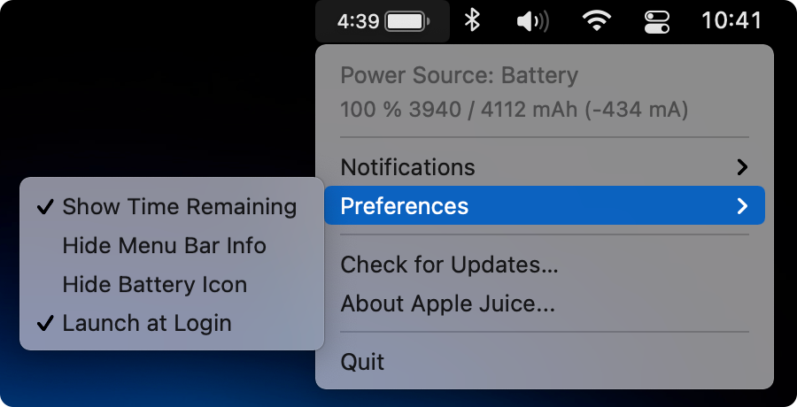

# Apple Juice #
An advanced battery gauge for macOS. *Apple Juice* can show you the estimated __battery time remaining__ and notify you, when your battery charge hits certain percentages.

### Today Widget ###

You can get even more information about your current battery status, without cluttering your screen, with the *Apple Juice Today Widget*. Just take a quick glance at your battery’s stats, whenever you want.

# How do I install it? #

* Install *Apple Juice* from the published binary, by downloading the [latest release](https://github.com/raphaelhanneken/apple-juice/releases/latest) and dropping it into your Applications folder.

* Install *Apple Juice* using [Homebrew](https://brew.sh/), using the command `brew cask install apple-juice`

* You can also download the source code and build it yourself. You'll have to have [Carthage](https://github.com/Carthage/Carthage) installed, and run `carthage bootstrap`, inside the project folder, to pull in the required dependencies.

## ATTENTION ##
__Loosen Gate Keeper Restrictions__
> As I'm not paying for an Apple Developer Account, you have to allow unsigned third party apps within the system preferences, to run *Apple Juice*. To allow unsigned apps choose `Anywhere` under `System Preferences: Security: Allow apps downloaded from`. If you don't have the option to select `Anywhere` you'll have to loosen the Gate Keeper restrictions by running `sudo spctl --master-disable` in the Terminal. [OSXDaily](http://osxdaily.com/2016/09/27/allow-apps-from-anywhere-macos-gatekeeper/) have a great step by step guide. Afterwards you should be able to select Anywhere.

__Remove Quarantine Attributes__
> Alternatively you can remove the quarantine attribute from the downloaded application package, as suggested by [henrycodebreaker](https://github.com/henrycodebreaker) in [issue #18](https://github.com/raphaelhanneken/apple-juice/issues/18). By executing the following command inside your Terminal: `xattr -cr /path/to/Apple\ Juice.app`.

# Why does this project exist? #
There are plenty of other solutions out there, so why make another one? I wanted an app that looks like it’s part of the system. As if it were built directly into macOS. Which can show me a lot of information, but only when I need them. And, most importantly, it should display notifications for several percentages. Since I haven’t found such an app, I made one myself.

# How do I contribute? #
You can fork this project, make your changes and send me a pull request. Make sure [SwiftLint](https://github.com/realm/SwiftLint) succeeds and everything is translated before submitting your pull request. Or, since the whole source code is licensed under the MIT License, fork *Apple Juice* and make your own thing. :-)

__________

# License #
The MIT License (MIT)

Copyright (c) 2015 - 2020 Raphael Hanneken

Permission is hereby granted, free of charge, to any person obtaining a copy of this software and associated documentation files (the "Software"), to deal in the Software without restriction, including without limitation the rights to use, copy, modify, merge, publish, distribute, sublicense, and/or sell copies of the Software, and to permit persons to whom the Software is furnished to do so, subject to the following conditions:

The above copyright notice and this permission notice shall be included in all copies or substantial portions of the Software.

THE SOFTWARE IS PROVIDED "AS IS", WITHOUT WARRANTY OF ANY KIND, EXPRESS OR IMPLIED, INCLUDING BUT NOT LIMITED TO THE WARRANTIES OF MERCHANTABILITY, FITNESS FOR A PARTICULAR PURPOSE AND NONINFRINGEMENT. IN NO EVENT SHALL THE AUTHORS OR COPYRIGHT HOLDERS BE LIABLE FOR ANY CLAIM, DAMAGES OR OTHER LIABILITY, WHETHER IN AN ACTION OF CONTRACT, TORT OR OTHERWISE, ARISING FROM, OUT OF OR IN CONNECTION WITH THE SOFTWARE OR THE USE OR OTHER DEALINGS IN THE SOFTWARE.
